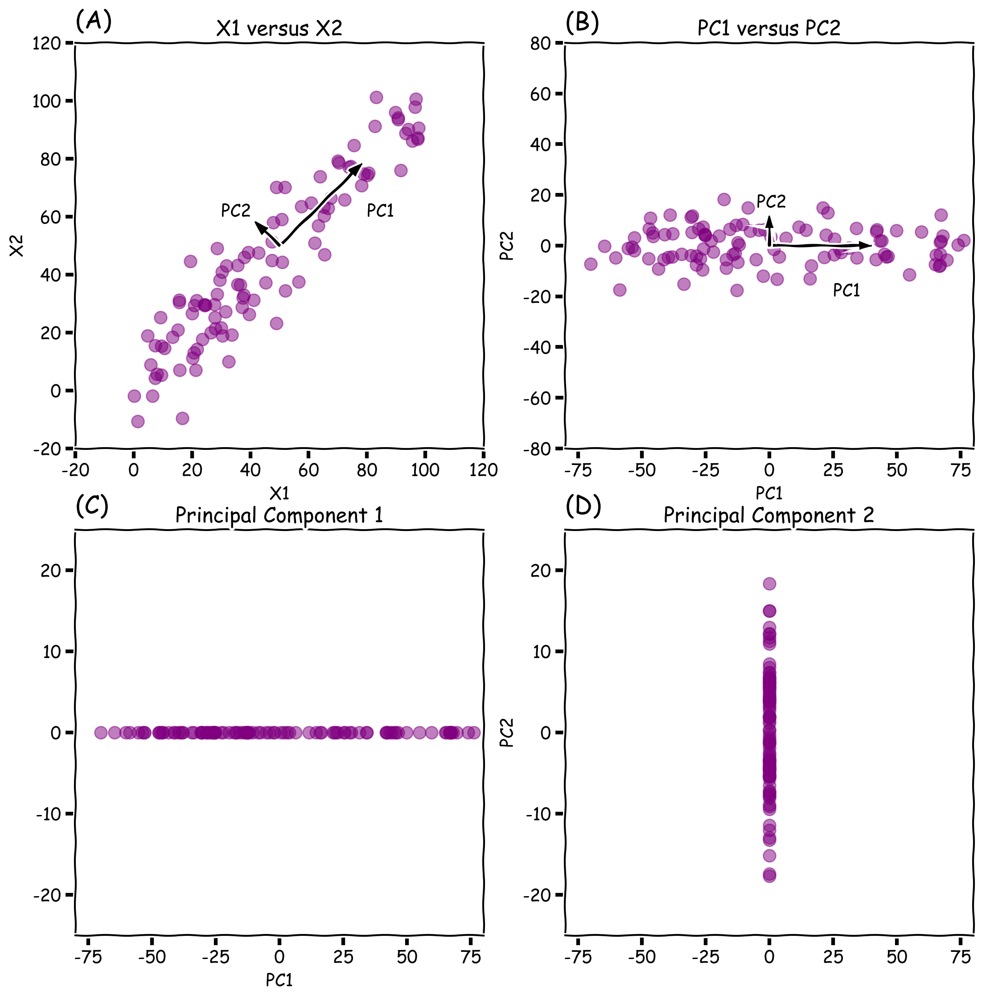
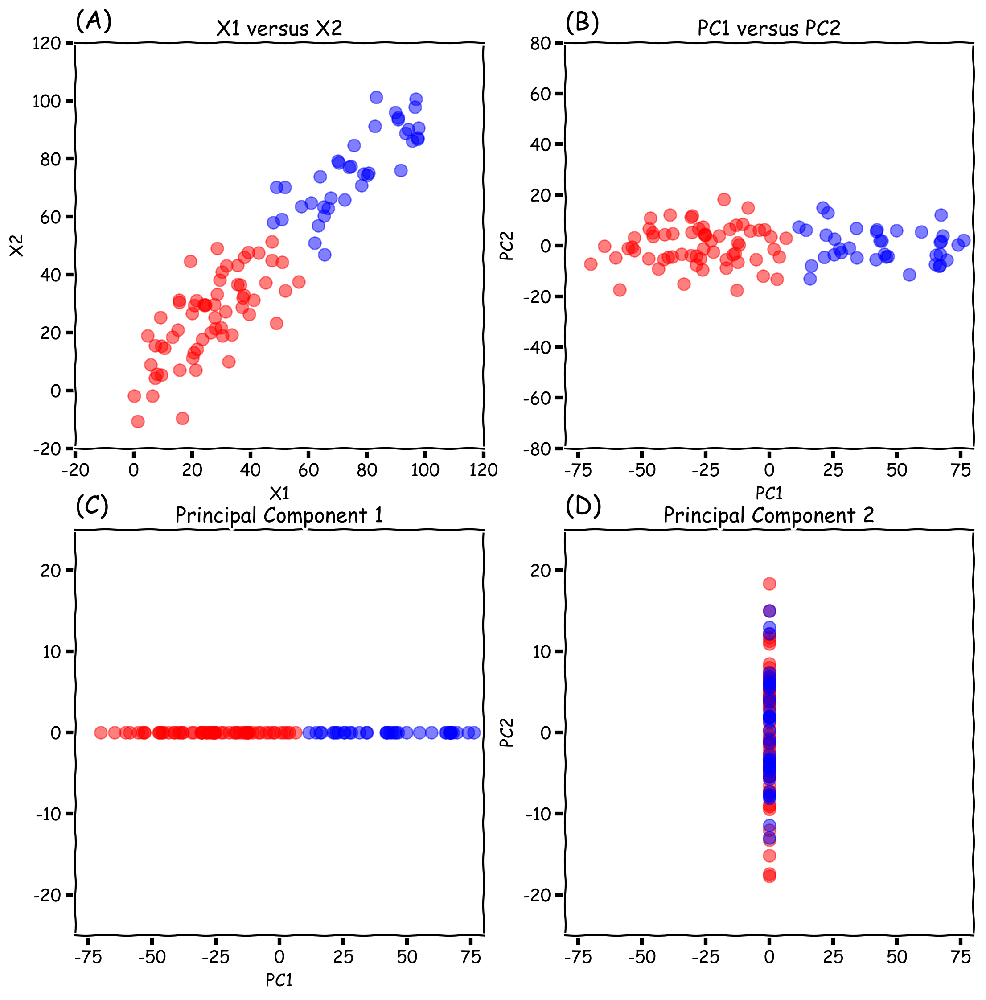
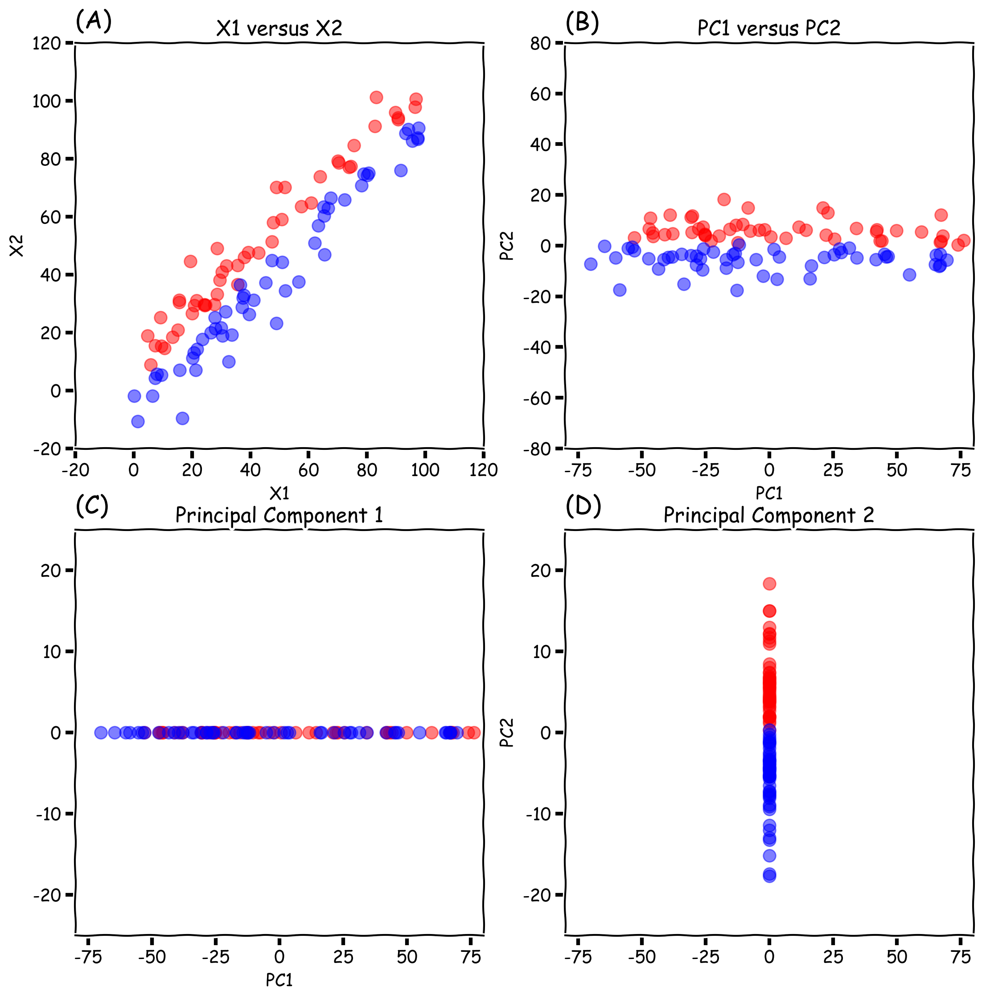

```python
import numpy as np
import pandas as pd
import matplotlib.pyplot as plt
from sklearn.decomposition import PCA

%matplotlib inline
%config InlineBackend.figure_format = 'retina'
plt.style.use('default')
plt.xkcd();
```

Create the data


```python
np.random.seed = 7
X = pd.DataFrame(np.random.random(100)*100)
X[1] = X[0]+np.random.randn(100)*10
```

Use Principal Component Analysis to change the axis


```python
pca = PCA(n_components=2, random_state=42)
X2 = pca.fit_transform(X)
```


```python
pca.explained_variance_ratio_
```


    array([ 0.96763994,  0.03236006])


```python
alpha = 0.5
s = 100
plt.figure(figsize=[13,13])
plt.subplot(2,2,1)
plt.xlabel('X1')
plt.ylabel('X2')
plt.scatter(X[0],X[1],c='purple',alpha=alpha,s = s)
plt.title('X1 versus X2')
plt.arrow(50,50,25,25,width=0.5,head_width=3,color='black')
plt.arrow(50,50,-5,5,width=0.5,head_width=3,color='black')
plt.text(80,60,'PC1')
plt.text(30,60,'PC2')
plt.axis([-20,120,-20,120])
plt.text(-20,125,'(A)',fontsize=20)

plt.subplot(2,2,2)
plt.scatter(X2[:,0],X2[:,1],c='purple',alpha=alpha,s = s)
plt.xlabel('PC1')
plt.ylabel('PC2')
plt.axis([-80,80,-80,80])
plt.title('PC1 versus PC2');
plt.arrow(0,0,np.sqrt(2*25**2),0,width=0.5,head_width=3,color='black')
plt.arrow(0,0,0,np.sqrt(2*5**2),width=0.5,head_width=3,color='black')
plt.text(25,-20,'PC1')
plt.text(-5,15,'PC2')
plt.text(-80,85,'(B)',fontsize=20)

plt.subplot(2,2,3)
plt.scatter(X2[:,0],np.zeros(len(X2)),c='purple',alpha=alpha,s = s)
plt.xlabel('PC1')
plt.title('Principal Component 1');
plt.text(-80,27,'(C)',fontsize=20)
plt.axis([-80,80,-25,25])

plt.subplot(2,2,4)
plt.scatter(np.zeros(len(X2)),X2[:,1],c='purple',alpha=alpha,s = s)
plt.ylabel('PC2')
plt.title('Principal Component 2');
plt.text(-80,27,'(D)',fontsize=20);
plt.axis([-80,80,-25,25]);
```





Create 2 types of labels y


```python
y1 = X[1]<100-X[0]
y2 = X[1]>X[0]
```

Data is separable by its direction of highest variance


```python
plt.figure(figsize=[13,13])
plt.subplot(2,2,1)
plt.xlabel('X1')
plt.ylabel('X2')
plt.scatter(X[y1][0],X[y1][1],c='red',alpha=alpha,s = s)
plt.scatter(X[y1==False][0],X[y1==False][1],c='blue',alpha=alpha,s = s)
plt.title('X1 versus X2')
plt.axis([-20,120,-20,120])
plt.text(-20,125,'(A)',fontsize=20)

plt.subplot(2,2,2)
plt.scatter(X2[y1,0],X2[y1,1],c='red',alpha=alpha,s = s)
plt.scatter(X2[y1==False,0],X2[y1==False,1],c='blue',alpha=alpha,s = s)
plt.xlabel('PC1')
plt.ylabel('PC2')
plt.axis([-80,80,-80,80])
plt.title('PC1 versus PC2');
plt.text(-80,85,'(B)',fontsize=20)

plt.subplot(2,2,3)
plt.scatter(X2[y1,0],np.zeros(len(X2[y1,0])),c='red',alpha=alpha,s = s)
plt.scatter(X2[y1==False,0],np.zeros(len(X2[y1==False,0])),c='blue',alpha=alpha,s = s)
plt.xlabel('PC1')
plt.title('Principal Component 1');
plt.text(-80,27,'(C)',fontsize=20)
plt.axis([-80,80,-25,25])

plt.subplot(2,2,4)
plt.scatter(np.zeros(len(X2[y1,1])),X2[y1,1],c='red',alpha=alpha,s = s)
plt.scatter(np.zeros(len(X2[y1==False,1])),X2[y1==False,1],c='blue',alpha=alpha,s = s)
plt.ylabel('PC2')
plt.title('Principal Component 2');
plt.text(-80,27,'(D)',fontsize=20);
plt.axis([-80,80,-25,25]);
```





Data is separable by its direction of lowest variance


```python
plt.figure(figsize=[13,13])
plt.subplot(2,2,1)
plt.xlabel('X1')
plt.ylabel('X2')
plt.scatter(X[y2][0],X[y2][1],c='red',alpha=alpha,s = s)
plt.scatter(X[y2==False][0],X[y2==False][1],c='blue',alpha=alpha,s = s)
plt.title('X1 versus X2')
plt.axis([-20,120,-20,120])
plt.text(-20,125,'(A)',fontsize=20)

plt.subplot(2,2,2)
plt.scatter(X2[y2,0],X2[y2,1],c='red',alpha=alpha,s = s)
plt.scatter(X2[y2==False,0],X2[y2==False,1],c='blue',alpha=alpha,s = s)
plt.xlabel('PC1')
plt.ylabel('PC2')
plt.axis([-80,80,-80,80])
plt.title('PC1 versus PC2');
plt.text(-80,85,'(B)',fontsize=20)

plt.subplot(2,2,3)
plt.scatter(X2[y2,0],np.zeros(len(X2[y2,0])),c='red',alpha=alpha,s = s)
plt.scatter(X2[y2==False,0],np.zeros(len(X2[y2==False,0])),c='blue',alpha=alpha,s = s)
plt.xlabel('PC1')
plt.title('Principal Component 1');
plt.text(-80,27,'(C)',fontsize=20)
plt.axis([-80,80,-25,25])

plt.subplot(2,2,4)
plt.scatter(np.zeros(len(X2[y2,1])),X2[y2,1],c='red',alpha=alpha,s = s)
plt.scatter(np.zeros(len(X2[y2==False,1])),X2[y2==False,1],c='blue',alpha=alpha,s = s)
plt.ylabel('PC2')
plt.title('Principal Component 2');
plt.text(-80,27,'(D)',fontsize=20);
plt.axis([-80,80,-25,25]);
```





```python

```
